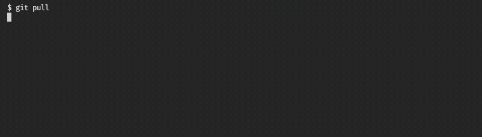

<h1 align="center">🍇 Fresko</h1>
<p align="center"><sup>(<em>fresh</em> in Basque)</sup></p>
<p align="center">A configurable cli that keeps your project deps fresh</p>

<p align='center'>

</p>

## Why?

_Have you ever pulled someone else's code into your local environment, only to realize later that your code doesn't work anymore?_

_Was it because that person added a new Node.js dependency, a new migration, or anything else that needs to be "loaded" through some command?_

With `fresko`, this will not happen - ever. 😀

Automatically react to changes in your repository, each time you're pulling new code, and never forget to run any critical command.

## Install

```sh
// npm
npm install -D fresko

// yarn
yarn add -D fresko

// pnpm
pnpm add -D fresko
```

## Usage

Create `fresko.config.ts` at project root

```typescript
import { declareConfiguration } from 'fresko'

export default declareConfiguration({
    prompts: [
        // Will remind you to install updated node deps
        {
            path: 'yarn.lock',
            command: 'yarn install',
        },
        // Will remind you to run updated database fixtures
        {
            path: [
                'src/migration'
                'src/fixtures'
            ],
            command: 'yarn loadFixtures'
        }
    ]
})

```

Add git hook on `post-merge` event (optional, recommended)

```sh
npx husky add .husky/post-merge "exec < /dev/tty && npx fresko || true"
```

> **Why `exec < /dev/tty`?** By default, git hooks are not interactive. This command allows the user to use their terminal to interact with Fresko during the hook.


## License

MIT License © 2022 [Quentin Hello](https://github.com/qhello)
